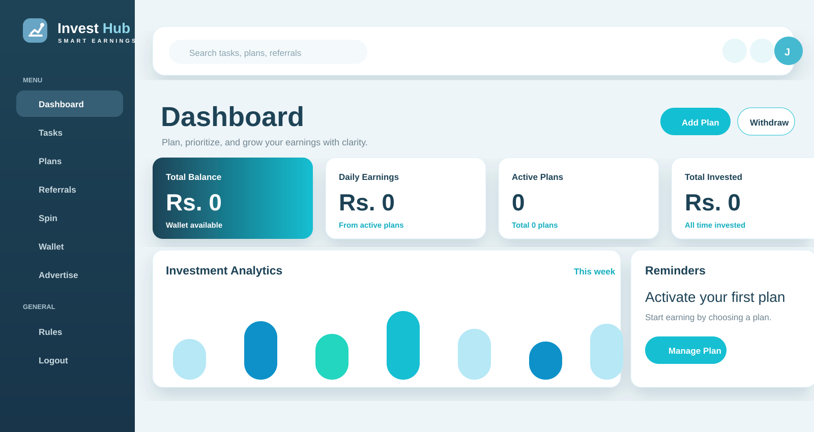

# InvestHub

InvestHub is a Django based smart earning and rewards platform. It combines investment plans, daily tasks, referrals, wallet withdrawals, advertiser campaigns, fraud checks, and a modern user dashboard in one product-style web app.

## Preview




## Features

- Modern landing page with InvestHub branding
- Login, registration, logout, and protected dashboard
- User dashboard with wallet, daily earnings, plans, progress, and activity
- Daily tasks and reward workflow
- Referral and commission foundation
- Spin rewards and gamification screens
- Wallet withdrawal flow with OTP support
- Advertiser panel and campaign foundation
- Legal pages for rules, terms, and privacy
- API v1 foundation for future mobile app support
- Celery/Redis-ready async task structure
- Fraud signal hooks, audit logs, and security middleware foundation
- PWA manifest and service worker support

## Tech Stack

- Python
- Django
- Bootstrap
- Moderna theme assets
- Chart.js
- SQLite for local development
- Celery-ready background task structure

## Project Structure

```text
earning_site/
  accounts/        User accounts and authentication
  ads/             Ad/watch flow foundation
  api/             API v1 endpoints
  earning_site/    Django project settings and URLs
  payments/        Payment gateway structure
  plans/           Investment plans and activation flow
  rewards/         Tasks, referrals, spin, fraud, advertiser tools
  wallet/          Wallet and withdrawal flow
  templates/       App templates
  static/          Theme, logo, images, CSS, JS
docs/              GitHub preview images
```

## Local Setup

```bash
cd earning_site
python -m venv ../venv
../venv/Scripts/activate
pip install -r requirements.txt
python manage.py migrate
python manage.py runserver
```

Open:

```text
http://127.0.0.1:8000/
```

Dashboard:

```text
http://127.0.0.1:8000/dashboard/
```

## Current Status

The project is an MVP+ foundation for a scalable reward ecosystem. It includes the UI theme, core account flows, dashboard, wallet, referral/task/gamification foundations, advertiser panel, security hooks, and production handoff notes.

Before public launch, connect real payment gateways, real offerwall providers, production PostgreSQL/Redis, and hardened fraud detection.

## Important Notes

InvestHub should be operated with clear earning rules, real payment verification, transparent withdrawal policies, and strict anti-fraud controls. Avoid fake earning promises or incentivized ad behavior that violates ad network policies.
